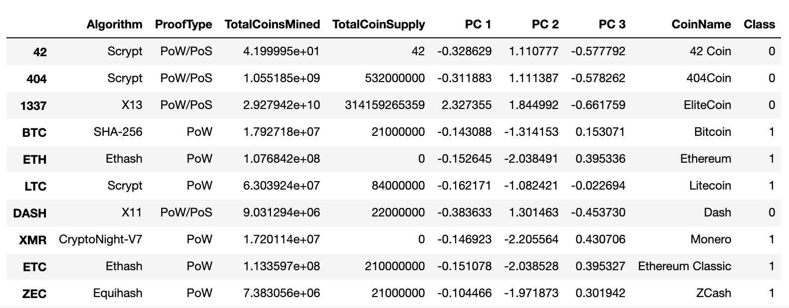

# Cryptocurrencies
Module 18

## Overview of Project
The purpose of this analysis is to determine if an optional cryptocurrency could offer an investment opportunity. The data collected through <a href="https://min-api.cryptocompare.com/data/all/coinlist ">CryptoCompare</a> was cleaned by focusing on cryptocurrencies that are currently being traded, are mined, and have a working algorithm. Additionally, for the unsupervised machine learning method, all NULL values were removed from the data set. This caused the data set to go from a content capacity of 1144 rows to 533 rows which minimizes the date but also maximizes it. 

## Results
PCA reduced the dimension of the data to three principal components:

 

An elbow curve was created to show the most efficient cluster amount needed. 

 

The clustered data frame shows the cryptocurrencies attributes: Algorithm, ProofType, TotalCoinsMined, TotalCoinSupply, CoinName, and Class, along with the three Principal Components derived from the PCA (1/2/3). 

 

A 3D Scatter plot provides a visualization where class is designated by the shape and color of the data point. 

 

The table created with the data provides that there are <b>533 Tradable Cryptocurrencies</b>

 

After scaling the data, a scatter plot is created plotting the data for the Total Coin supply verse the Total Coins Mined. 

 

